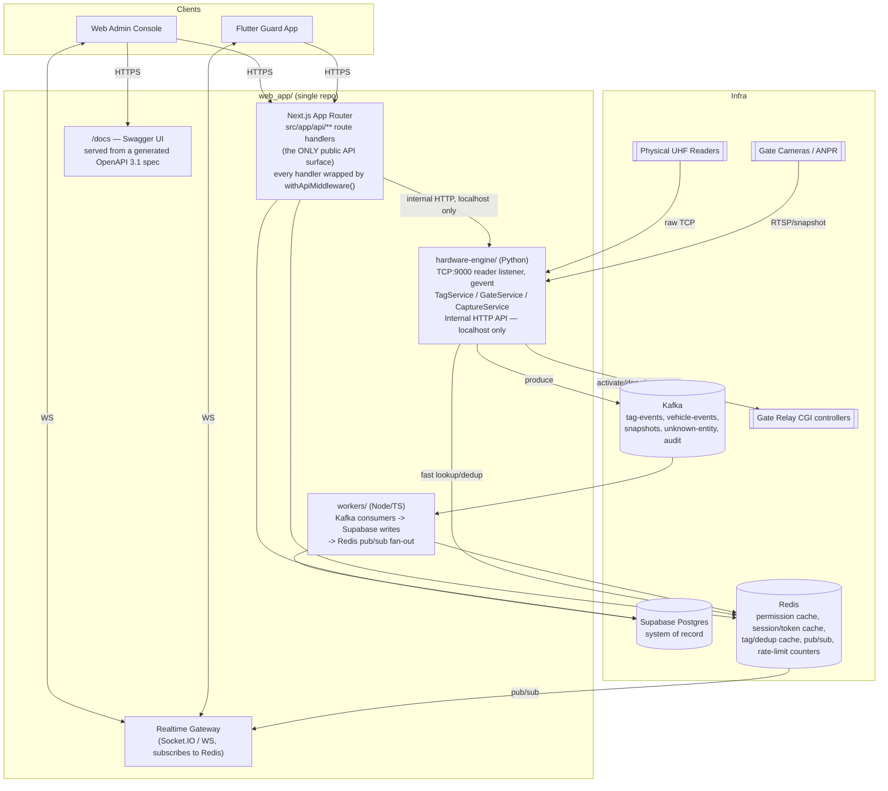

# UHF RFID Reader Application — Full Project Analysis Transcript

**Date of analysis:** 2026-09-06 (initial four sub-projects), extended 2026-09-07 (two more discovered)
**Scope:** Read-only analysis of all six sub-projects under `uhf_rfid_reader_application_old/`. No source files were modified.
**Root path:** `/Users/santosh/Documents/Santosh/santosh_workspace/uhf_rfid_reader_application_old/`

**Update log:**
- 2026-09-06 (initial) — Sections 0–6: read-only analysis of the four existing sub-projects.
- 2026-09-06 (update) — Section 7 added: new **planned feature roadmap** (RBAC, org hierarchy, vehicle governance, unknown-entity detection workflow, camera/UHF capture pipeline) requested for the **next build**, targeting both a **web app** and a **Flutter mobile app**. This is forward-looking product requirement capture, not analysis of existing code — kept clearly separate from Sections 0–6.
- 2026-09-06 (update) — Section 8 added: the **master technical architecture plan** for the new build (system design, RBAC/permission engine, repo layout, phased roadmap), plus **API documentation & security middleware standards** and a **full theming system** (violet/blue palette family, ≥5 combinations, light + dark) requested as durable, always-applied engineering standards for `web_app/`.
- 2026-09-06/07 — `web_app/` Phase 0/1 actually built (schema + seed, theme system, auth/RBAC middleware, admin shell and Dashboard/Tag Detection/Readers/Organization/Vehicles/Unknown Entities/Users & Roles/Settings screens, permission-matrix editor, vehicle site/gate authorization writes). Tracked in git history, not narrated here — this document stays the plan, not a build log.
- 2026-09-07 (update) — Two more legacy sub-projects discovered under `uhf_rfid_reader_application_old/` (§4.5 `UHFReaderUtility`, §4.6 `UHFTagWrite_WEB`) — Executive Summary and §5 Cross-Project Synthesis updated accordingly. §7.8 added: `UHFTagWrite_WEB` turned out to be a **real, working Tag Writing/hardware-encoding backend** (the feature every newer prototype only ever simulated), with a genuine reader wire protocol, a deterministic EPC-composition formula, and a write-audit/tag-registry data pattern not documented anywhere else in this workspace — captured as implications for the new build's future Tag Writing module, not yet implemented.
- 2026-09-07 (update) — §7.9 added: five new realtime/hardware requirements given directly by the user — location-scoped and reader-scoped socket rooms (reusing the existing permission-scoping mechanism), a gate busy/available status machine gating auto-open (Redis-backed, TTL safety net), a `vehicleVisits` arrival/dispatch pairing table for dwell-time history, and a unified search resolver so history lookup works from an employee name/code, asset name, or vehicle plate instead of requiring the raw EPC. Schema block in §8.2 updated (`vehicleVisits`, `vehicleDetections.direction`, `cameras.locationType`); §8.1 and §8.6 cross-referenced. Not yet implemented.

---

## 0. Executive Summary

This workspace contains **six separate, loosely-related sub-projects** (four originally analyzed, plus two more found 2026-09-07 — §4.5, §4.6) that together represent the evolution of a single product: an enterprise **UHF RFID access-control and asset/vehicle-tracking system** (product name appears to be **"AIRIS"**, built by a company referred to as **Aether**). They share a common SQL Server schema (`AIRIS_JAFAR` / `AIRIS` / `COSEC`) and a common domain model (Employees, Vehicles, Assets, Readers, Gates, Tags), but are **not currently wired together as one running system** — each was clearly built at a different time, by a different iteration of the team/tooling, and several contain unfinished, simulated, or dead code.

| # | Sub-project | Role | Stack | Maturity |
|---|---|---|---|---|
| 1 | `UHF Python` | Real-time ingestion engine — TCP listener for physical RFID readers, tag resolution, gate-relay triggering, Socket.IO event bus, historical ANPR (plate recognition) companion | Python 3.12, gevent, python-socketio, pyodbc (SQL Server), Redis | Most functionally complete backend; has real hardware protocol handling, but has bugs, duplicated legacy code, and lost ANPR source |
| 2 | `UHFReaderFlow` | Web dashboard + ingestion gateway, Replit-scaffolded | Node.js/TypeScript, Express, React 18 + Vite, Wouter, TanStack Query, shadcn/ui | Functionally rich UI, but backend is largely **simulated** (fake data generator, stubbed gate/ID-card actions) and uses flat-file JSON storage, not a real DB |
| 3 | `rfid-dashboard` | Operator-facing live dashboard + vehicle gate/CCTV terminal (pure frontend client) | React 19 + Vite, socket.io-client, hls.js | Live path is functional and connects to a real Socket.IO gateway; ~20% of the codebase is a dead, unstyled "V2" rewrite attempt |
| 4 | `uhf-reader-dashboard` | Simple admin CRUD console for master data (readers/gates/vehicles/tag binding) | Python Flask, pyodbc (SQL Server), vanilla JS/HTML | Smallest, oldest-looking, prototype-grade; no auth, no `.env`, hardcoded credentials |
| 5 | `UHFReaderUtility` | Alternate C# reader bridge — TCP poll loop pushing detected EPCs to a local WebSocket | .NET (net10.0) console app, Newtonsoft.Json, Websocket.Client | Minimal, single-file, no DB/gate integration; redundant with `UHF Python`'s job, less complete |
| 6 | `UHFTagWrite_WEB` | **Real** tag-writing / hardware-encoding backend — the feature every newer prototype only simulated | ASP.NET Core Web API, Dapper, SQL Server (`AIRIS_JAFAR`) | Genuinely working (real write-transaction logs from June 2024); API-only, single shared-secret auth, real password-lock write sequence |

**Overall picture:** The parent folder name (`..._old`) and the fragmentation across six independent stacks strongly suggest this is a **legacy/exploratory collection of prior attempts** at building the same product — likely superseded by (or a starting reference point for) a newer unified build. `UHF Python` is the most "real" backend for live tag *reading* (actual TCP hardware protocol, real gate relay HTTP calls, real DB writes); `UHFTagWrite_WEB` is the most "real" backend for tag *writing* (§4.6) — the two were apparently never merged into one service. `rfid-dashboard`'s live pages appear to be the frontend actually paired with `UHF Python` (matching Socket.IO event names like `tag_event`, `bind_tag`, `request_tag_history`, and gate CGI relay calls). `UHFReaderFlow` and `uhf-reader-dashboard` look like separate, disconnected/earlier prototypes that were never fully integrated with the real hardware layer, and their "Tag Writing" UI (§2) was built without ever being wired to `UHFTagWrite_WEB`'s real endpoint. `UHFReaderUtility` (§4.5) is a third, redundant attempt at the same job `UHF Python`'s TCP listener already does.

**Cross-cutting concerns found in nearly every sub-project:**
- Hardcoded credentials committed to source (DB passwords, RTSP camera passwords, a SQL `sa` password in `UHFTagWrite_WEB/appsettings.json`) in 5 of 6 sub-projects.
- No authentication/authorization anywhere in the entire system beyond single shared secrets (an API key GUID, or nothing at all).
- Significant dead/duplicate code (legacy procedural Python file duplicating the OOP one; a whole unused "V2" React UI cluster; unused ORM/auth dependencies; a redundant C# reader bridge; unused GenericHid USB boilerplate wired into DI but never called).
- Documentation drift — several markdown docs describe an earlier or different version of the code than what's actually present.
- No automated tests anywhere across all six sub-projects.
- **At least three mutually incompatible UHF reader wire protocols** exist across this workspace (`UHF Python`'s `0xBB`-framed protocol, `UHFReaderUtility`'s two candidate protocols, `UHFTagWrite_WEB`'s `0x50`-command CRC-16 protocol) with no note anywhere confirming which physical reader hardware each actually targets — flagged as an open item in §8.9.

---

## 1. `UHF Python` — Real-Time Ingestion Engine

**Path:** `UHF Python/`

### Purpose
Backend real-time engine for the AIRIS access-control/asset-tracking product. Listens for raw TCP packets from physical UHF RFID readers, resolves scanned EPC tags against SQL Server (Employee / Vehicle / Asset), pushes live events to clients over Socket.IO, and auto-triggers gate/boom-barrier relays for authorized vehicles. Also historically included an ANPR (Automatic Number Plate Recognition) camera subsystem.

### Tech Stack
- Python 3.12, **gevent** (monkey-patched cooperative concurrency — not asyncio/threading)
- `python-socketio` (async_mode="gevent") over `gevent.pywsgi.WSGIServer` + `WebSocketHandler`
- `pyodbc` → Microsoft SQL Server (ODBC Driver 18/17/13 auto-detected)
- `redis` + `cachetools.TTLCache` (2-tier L1/L2 cache)
- No web framework for the main app (raw WSGI + Socket.IO); `requests` is imported but never used — HTTP calls to gate controllers go through `subprocess` + `curl` instead.

### Entry Points
- **`UHFServices.py`** (1337 lines) — current, canonical, class-based implementation (confirmed authoritative by `db_manage.md` line-number references). Runs Socket.IO/HTTP on port **9002** and a raw TCP listener on port **9000**.
- **`UHFMaster.py`** (1275 lines) — older procedural/global-function version of the *same* logic (~95% duplicate of `UHFServices.py`). Appears to be dead/legacy code that should be removed or clearly deprecated.
- **`server.py`** (5 lines) — not a server; a broken one-off test script (`s.connect(('172.40.4.26'), 4660)` passes two args instead of a tuple → `TypeError` if run).

### Architecture
- **ConfigService** — loads Locations/Readers/Gates from SQL Server into in-memory maps, refreshed every 5 min or on-demand (`reload_configuration` event / `GET|POST /api/reload`); mirrored into Redis.
- **ConnectionService** — tracks live sockets per (location, reader); supports inbound (readers dial in) and optional outbound (server dials readers, gated by `CONNECT_TO_READERS`, default off).
- **DatabaseService** — hand-rolled `pyodbc` connection pool (size 8) via `gevent.queue.Queue`.
- **CacheService** — 2-tier cache (TTLCache 300s → Redis) for tag lookups and DB-write de-duplication (`epc:reader` key, 300s TTL).
- **GateService** — checks `VehicleManagementMst.IsGateAccess`; if authorized, calls gate relay controller HTTP CGI endpoints (`activateauxrelay`/`deactivateauxrelay`) via `curl` subprocess, 3s hold.
- **TagService** — core EPC resolver: multi-join SQL across `UHFData`, `AstDeviceDetails`, `AstAllocationdet`, `EmployeeMst`, `VehicleManagementMst`, plus cross-DB photo lookups (`AIRIS.dbo.EmployeePhotoDet`, `COSEC.dbo.Mx_UserPhoto`); also `search_targets` (fuzzy LIKE search) and `bind_tag`/`bind_tag_force`.
- **HistoryService** — async queue writer to `UHFHistory` + capped (500) Redis sorted set per EPC.
- **PacketProcessingService** — parses raw TCP protocol: frame starts `0xBB`, bytes 4–8 = little-endian reader ID, byte 8 = EPC length, then EPC hex bytes. Valid EPCs upserted into `UHFData`, resolved, broadcast as `tag_event`.
- **Socket.IO events:** `connect`/`disconnect`, `request_tag_details`, `reload_configuration`, `search_targets`, `bind_tag`, `bind_tag_force`, `request_tag_history`.

### ANPR Subsystem — Important Gap
The `ANPR/` folder in the current working tree is **effectively empty** (only a stray `.pyc`). Full source (`utils.py`, `detector.py`, `ANPRCamera.py`, `app.py`, `app1.py`/`app2.py`, YOLOv8 weight files) only exists in git history at commit `6da5a5d`, on a branch **not reachable from the currently checked-out `dev_santu` branch**. Historically: YOLOv8 (plate detection) + EasyOCR/PaddleOCR (text extraction) reading an RTSP camera stream, writing to an `OCRDetections` table in the same DB, with a small Flask dashboard. It was never cross-referenced with the RFID detection tables — joined only by sharing a database/site.

### Data / Storage
- MS SQL Server DB `AIRIS_JAFAR` (12 tables per `db_manage.md`: locations, readers, gates, employees, vehicles, assets, live detections `UHFData`, audit trail `UHFHistory`) + cross-DB joins to `AIRIS.dbo.EmployeePhotoDet` and `COSEC.dbo.Mx_UserPhoto` (a Matrix/COSEC access-control system).
- Redis for config cache, tag-detail cache, write-dedup markers, per-EPC history.
- No local image storage — photos served from `myapp.airis.co.in` URLs.
- `db_manage.md` is a detailed, well-written schema/architecture doc with a Mermaid data-flow diagram — a good reference document.

### External Integrations
SQL Server (cross-DB), Redis, gate relay HTTP CGI controllers (via `curl`), Socket.IO (CORS wide open `*`), raw TCP (port 9000) for reader hardware, remote image CDN. Historically: RTSP camera + YOLOv8/EasyOCR/PaddleOCR.

### Environment Variables
`DB_USER`, `DB_PASSWORD`, `DB_SERVER`, `DB_NAME`, `REDIS_HOST`, `REDIS_PORT`, `REDIS_PASSWORD`, `CONNECT_TO_READERS`. Also referenced with code defaults (not in `.env`): `READER_PORT`, `TCP_HOST`, `TCP_PORT`, `SIO_HOST`, `SIO_PORT`, `CACHE_TTL`, `DB_WRITE_TTL`, `HISTORY_REDIS_TTL`.

### Key Issues Found
- **Hardcoded credentials**: `.env` has plaintext DB/Redis passwords, *and* both `UHFMaster.py`/`UHFServices.py` hardcode the same values again as source-level fallback defaults — meaning secrets are committed to git regardless of `.env` gitignore status.
- **Real latent bug** in `UHFMaster.py`: `socket` module never imported, but `reader_outbound_worker()` calls `socket.socket(...)` → `NameError` if `CONNECT_TO_READERS=True` (currently `False`, so dormant). `UHFServices.py` fixes this correctly.
- **`server.py` is broken** (`socket.connect()` called with two args instead of a tuple).
- **Dead code**: `requests` imported but unused; `GATE_AUTH_HEADER` defined but never actually passed into the curl command (malformed `--header "Authorization;"` — any auth token config is silently ignored).
- **Duplicate implementation risk**: `UHFMaster.py` vs `UHFServices.py` — keeping both risks divergence.
- **README.md** is unedited GitLab boilerplate.
- Git history is fragmented across many parallel branches (`main`, `mac`, `windows`, `dev_feel`, `dev_grok`, `dev_santu`) — direct cause of the lost ANPR source.
- No automated tests.
- Every tag scan unconditionally spawns a gate-access-check greenlet, even for non-vehicle tags (minor inefficiency, not a bug).

### File Tree (excl. venv/__pycache__/.git)
```
UHF Python/
├── .env
├── .gitignore
├── ANPR/                 (effectively empty; source recoverable via `git show 6da5a5d:ANPR/<file>`)
├── README.md             (unedited template)
├── UHFMaster.py           (legacy procedural implementation, 1275 lines)
├── UHFServices.py         (current OOP implementation, 1337 lines — canonical)
├── db_manage.md           (schema/architecture doc, 249 lines)
├── logs/                  (present, empty)
├── requirements.txt
└── server.py              (broken test script, 5 lines)
```

---

## 2. `UHFReaderFlow` — Web Dashboard + Ingestion Gateway (Replit-scaffolded)

**Path:** `UHFReaderFlow/`

### Purpose
A full-stack Node.js/TypeScript app combining a TCP hardware-ingestion gateway with a React admin dashboard. Per its own `DEPLOYMENT_GUIDE.md`, it's meant to be one of several services in a 4-port architecture (this app on 4000/9000, a separate Socket.IO gateway on 9002, a separate FastAPI "enterprise core" on 8000) — the other two services are **not present** in this sub-project, confirming this is one piece of a larger, only-partially-implemented system design.

### Tech Stack
- Node.js (ESM), TypeScript 5.6, `tsx` (dev), `esbuild` (prod bundle → `dist/index.cjs`)
- Server: Express 4.21, raw `net` (TCP), `ws` (WebSocket)
- Client: React 18.3 + Vite 5, **Wouter** (routing, not react-router), TanStack Query v5, shadcn/ui ("new-york"), Tailwind 3.4, Recharts, react-hook-form + zod
- Replit scaffolding still present (`.replit`, Replit Vite plugins, `.local/state/replit/agent/*`)
- `drizzle-orm`/`drizzle-zod`/`drizzle-kit`/`pg`/`connect-pg-simple`/`passport`/`passport-local`/`express-session`/`memorystore` are all **installed but entirely unused** — the app actually runs on flat-file JSON storage (`server/storage.ts`), confirmed by `replit.md` itself.

### Architecture / Data Flow
`server/index.ts` wires: Express (JSON body parsing + `/api/*` request logger) → WebSocket server at `/ws` (same HTTP server) → independent raw TCP server on port 9000 → REST routes → Vite dev-middleware or static prod serving.

**Hardware → server** (`server/tcp_listener.ts`): reader dials in on port 9000; `parseUHFFrame()` scans for `0xBB` header, reads EPC-length byte at offset+8, extracts EPC hex, reads RSSI byte after. In-memory `dedupCache` suppresses repeats within 5s. Resolves reader by matching `socket.remoteAddress` against `readers.json` — **falls back to the first reader in the list if no IP match** (data-integrity gap). Resolves employee by `tagId === epc`. Writes detection + log, broadcasts `tag_detected` over WebSocket. Parser only handles one frame per buffer read and resets the buffer afterward — fragile for multi-frame chunks.

**Server → browser**: simple pub/sub `RealtimeServer` (`server/websocket.ts`); client hook `use-websocket.ts` auto-reconnects (3s) and invalidates TanStack Query caches on `tag_detected`/`gate_event` (cache-invalidation-driven "real-time", not direct push); several dashboard queries also poll every 3s as a fallback.

**Built-in simulation loop**: `routes.ts` runs a `setInterval` every 4000ms that fabricates random tag-detection events from active employees + online readers and broadcasts them — **runs unconditionally in all environments**, not gated by an env flag. This is very likely why `data/detections.json` (10,812 records) and `data/logs.json` (10,843 records) have grown so large from local testing.

### Data Model (`shared/schema.ts` — pure Zod, no Drizzle tables defined)
Employee, Reader, Gate, Tag, TagDetection, SystemLog, TagWriteRequest (input-only), DashboardStats — each maps to a `data/*.json` flat file. `drizzle.config.ts` targets Postgres but the schema file has zero Drizzle table defs, so `npm run db:push` would do nothing — leftover Replit scaffolding never wired up.

### API Routes (selected, full list in sub-report)
Dashboard stats; Employees CRUD; Readers CRUD + `/metrics` (simulated via `Math.random()`); Gates CRUD + `/:id/open` (updates JSON + broadcasts WS event — **does not actually call the gate relay HTTP CGI endpoint** documented in `DEPLOYMENT_GUIDE.md`) + `/:id/emergency`; Tags CRUD; Tag-detections list/recent; Logs list/recent; `/api/rfid/connect|disconnect` (simulated); `/api/rfid/write-tag` (simulated, fabricates random tag+detection); `/api/id-cards/generate` (stub — sleeps 800ms, returns a count, **produces no actual PDF**). No auth/session middleware wired into any route despite passport/session dependencies being installed.

### Client App
`App.tsx` — Wouter router, 8 routes (`/`, `/tag-detection`, `/readers`, `/employees`, `/id-cards`, `/tag-writing`, `/device-monitor`, `/logs`) + catch-all. `QueryClientProvider` (staleTime: Infinity, no refetch-on-focus — updates rely on explicit invalidation) → `ThemeProvider` → `TooltipProvider`. 30+ shadcn/ui primitives vendored under `components/ui/`. Pages include a 3s-polling dashboard, a 4-step tag-writing wizard (Connect→Select→Write→Confirm), device monitor, logs viewer.

### Existing Documentation
- `replit.md` — architecture/feature overview, **stale** relative to code (omits Gates, `/api/rfid/*`, `/api/id-cards/*` routes added later).
- `DEPLOYMENT_GUIDE.md` — documents the intended 4-service architecture and real hardware wiring (readers dial out to port 9000; gate relays driven by CGI `device.cgi/command?action=activateauxrelay`) — **the app itself never calls these CGI URLs**, a documented-but-unimplemented gap. Gives 3 deployment options (raw, PM2, systemd).
- `design_guidelines.md` — detailed Material-Design-influenced UI spec (fonts, spacing, per-page layout, accessibility, animations) — actually reflected in the real page code.
- `attached_assets/` (filenames only, not extracted): `UHF_Project_Workflow.pdf`, `UHFTagSocket.pdf` (likely the real TCP frame spec), `UHFTagWrite.pdf`, `IntegratedReader.zip`, `TagRegisterReader.zip`, `DoorStatus.pdf`, `IDCardMasterAPIDoc.pdf`, `DataReplicationforidcard.pdf` — these suggest the *real* protocols are documented but only superficially/partially implemented in code (much of `routes.ts` is `setTimeout`-simulated).

### Environment Variables
`.env`: `PORT`, `TCP_PORT`, `SOCKET_PORT`, `NODE_ENV`. `.env.development`/`.env.production`: `PORT`. Code also references `DATABASE_URL` (unused, would only matter for `db:push`) and `REPL_ID` (Replit plugin gating).

### Key Issues Found
- Dead ORM/auth dependency stack (drizzle, pg, passport, express-session, memorystore) — no auth on any route.
- Unbounded JSON growth (10k+ records in detections/logs) — every write reads+rewrites the *entire* file, no rotation/cap, no atomic write (crash-mid-write risk).
- Always-on fake-data simulation loop pollutes real data in every environment.
- Reader-IP-fallback bug silently misattributes unrecognized readers' detections to `readers[0]`.
- Gate relay and ID-card generation are both stubs, not wired to real hardware/output despite being documented as real integrations.
- **Port inconsistency**: `server/index.ts` defaults to 4000; `.replit`/`ecosystem.config.cjs` use 5000; `DEPLOYMENT_GUIDE.md` says 4000 — these disagree. `ecosystem.config.cjs` also has a typo: `NODE_ENV: "developement"`.
- No pagination on any list endpoint despite 10k+ row datasets.
- `replit.md` stale vs. actual routes.

### File Tree (abbreviated — full tree in sub-agent report)
```
UHFReaderFlow/
├── .env / .env.development / .env.production
├── .replit, .vscode/settings.json
├── DEPLOYMENT_GUIDE.md, design_guidelines.md, replit.md
├── components.json, drizzle.config.ts, ecosystem.config.cjs
├── package.json, tailwind.config.ts, tsconfig.json, vite.config.ts
├── attached_assets/    (8 hardware/protocol docs)
├── data/               (employees, readers, gates, tags, detections[10.8k], logs[10.8k])
├── script/build.ts
├── shared/schema.ts
├── server/ (index.ts, routes.ts, storage.ts, tcp_listener.ts, websocket.ts, vite.ts, static.ts)
└── client/src/ (App.tsx, main.tsx, components/, hooks/, lib/, pages/)
```

---

## 3. `rfid-dashboard` — Operator Live Dashboard & Vehicle Gate Terminal

**Path:** `rfid-dashboard/`

### Purpose
A **pure frontend client** (no backend of its own) — the security-gate operator terminal: real-time RFID tag board (vehicles/assets/staff/contractors/unassigned), tag-binding UI, vehicle-gate terminal with CCTV/HLS camera feeds and boom-barrier control. Talks to two external services via `.env`:
- Socket.IO **RFID gateway** (`VITE_SOCKET_URL`) — event names (`tag_event`, `bind_tag`, `search_targets`, `request_tag_history`) **match `UHF Python`'s Socket.IO surface exactly**, strongly suggesting this is the real paired frontend for the `UHF Python` backend engine (§1).
- **Camera/CGI server** (`VITE_CAM_SERVER`) — camera list/HLS streaming + gate relay CGI calls.

### Tech Stack
- React 19.2.4, **Vite 6.0.7 is the active build tool** (CRA fully retired at the tooling level, though its file artifacts remain as dead weight).
- `react-router-dom` is a dependency but **unused** — page switching is local `useState` in `App.jsx`, not routing.
- No state-management library — local hooks only.
- Two conflicting style systems: hand-written CSS (used by the *live* pages) vs. Tailwind utility classes (used by a *dead*, unwired page cluster) — **Tailwind is not installed/configured at all**, so that dead code would render unstyled if ever mounted.
- `socket.io-client` (two independent singleton sockets: RFID + camera), `hls.js` as an npm dep but the actually-used hook loads `hls.js` from a **CDN** instead (npm dep unused).

### Architecture — Live Path
`Dashboard.jsx` (default page) subscribes to the RFID socket's `tag_event`, classifies each tag (`utils/helpers.js: classifyTag`) into vehicle/asset/aetherian(employee)/unassigned, keeps state keyed by EPC, auto-purges idle tags after 60s (`AUTO_REMOVE_MS`), renders filterable columns with per-tag actions (Bind, History, Hide, Remove, "Manage vehicle"). Selecting a vehicle switches (via local state, no router) to `VehicleManagement.jsx` — a full-screen gate terminal with live HLS camera grid (`IPCameraFeed`), driver/owner info, visitor sidebar, and "Grant Access" → `callGateAPI('open', ...)` (direct CGI relay call to the gate hardware) with a 3s auto-close timer.

### Dead Code — "V2" Cluster (~20% of `src/`)
`pages/DashboardPage.jsx`, `pages/VehicleTerminalPage.jsx`, `hooks/useTagFeed.js`, `components/layout/Header.jsx`, `components/rfid/TagFeed.jsx`, `components/rfid/TagDetailModal.jsx`, `components/camera/CameraGrid.jsx`, `components/gate/GateControlPanel.jsx` — a self-contained alternate implementation, never imported anywhere, built with Tailwind (which isn't configured), and listening for a different/incompatible socket event name (`rfid_tag_detected` vs. the live `tag_event`). Also duplicates `classifyTag()` logic with subtle differences from the live version — a maintenance hazard.

### Existing Documentation
- `README.md` — 100% stock CRA boilerplate, not project-specific.
- `RUN_GUIDE.md` — genuinely useful, accurate, Vite-based setup/troubleshooting guide with example `.env` values.
- `PROJECT_REVIEW.md` — an audit of an **earlier snapshot** of this codebase (references files like `App.js` 1,303-line monolith, `santu.js` 2,684-line scratch file, `react-scripts`) — **none of these exist anymore**; the code has since been refactored into the current structure and migrated to Vite. Its flagged concerns (hardcoded RTSP creds, dead files, monolith architecture, socket lifecycle) are informative even though stale — notably, hardcoded RTSP credentials are **still present today** in the current code.

### Environment Variables
`.env`: `VITE_SOCKET_URL`, `VITE_CAM_SERVER`, `REACT_APP_SOCKET_URL`, `REACT_APP_CAM_SERVER` (legacy-compat aliases; `vite.config.js` explicitly whitelists both prefixes).

### Key Issues Found
- **Hardcoded RTSP camera credentials and internal IPs in client-side source** (`src/config/api.js` `CAM_PRESETS`) — shipped in the browser bundle, trivially recoverable via devtools, exposing camera admin passwords and internal network topology.
- **Confirmed bug**: `GATE_API` is commented out (not exported) in `config/api.js`, yet `services/gateApi.js` imports and calls `fetch(GATE_API, ...)` — resolves to `fetch(undefined, ...)`. The documented backend gate-control fallback path is silently broken (masked in practice by the direct CGI relay call that fires first/independently).
- CRA leftovers coexist with Vite files (`public/index.html` vs root `index.html`, `src/index.js` vs `src/main.jsx`) — dead but harmless.
- `.gitignore` still ignores `/build` (CRA) not `/dist` (Vite's actual output) — build output would not be gitignored as intended.
- Socket singletons (`services/socket.js`) never call `.disconnect()` — potential duplicate-listener risk under React 19 StrictMode/hot-reload.
- Default fallback IPs in code differ from example IPs in `RUN_GUIDE.md`.
- Heavy use of inline `style={{...}}` objects in several components, inconsistent with the CSS-class approach used elsewhere.

### File Tree (abbreviated)
```
rfid-dashboard/
├── .env, .gitignore, README.md, PROJECT_REVIEW.md, RUN_GUIDE.md
├── index.html (Vite entry — active), vite.config.js
├── public/ (CRA leftovers, unused under Vite)
└── src/
    ├── App.jsx (active), main.jsx (active), index.js (dead), App.css
    ├── config/api.js  (env config + hardcoded RTSP creds)
    ├── services/ (socket.js, gateApi.js [GATE_API bug])
    ├── hooks/ (useTagFeed.js [dead], useHlsLib.js [active])
    ├── utils/helpers.js
    ├── pages/ (Dashboard.jsx*, VehicleManagement.jsx*, DashboardPage.jsx†, VehicleTerminalPage.jsx†)
    └── components/ (rfid/, modals/, camera/, gate/, vehicle/, layout/)
      (* = live, † = dead/unwired)
```

---

## 4. `uhf-reader-dashboard` — Master-Data Admin Console

**Path:** `uhf-reader-dashboard/`

### Purpose
A standalone Flask REST API + single-file HTML/JS admin console for managing master/reference data — sites, readers, gates, vehicles, and tag-to-entity bindings. **Not** a real-time tag-processing engine. Its `db_manage.md` is a verbatim copy of `UHF Python`'s schema documentation (still references `UHFServices.py` file paths), confirming it was built against the **same SQL Server schema** as the real-time engine, as a lightweight companion CRUD tool — not a rewrite of it.

Given it has no `.git`, no `.env`, no build tooling, and restrictive file permissions (`drwx------`, unlike its three sibling projects which are all world-readable `755`), this looks like the **earliest/simplest prototype** in the collection — plausibly the origin of the "old" in the parent folder's name.

### Tech Stack
Flask 3.0.3, `flask-cors`, `pyodbc` (SQL Server, ODBC driver auto-detect). Frontend: single static `index.html` (46KB, vanilla JS, `fetch()`-based, no framework/build step, no WebSocket).

### Architecture
`app.py` (872 lines): `CORS(app)` wide open; `get_connection()` opens a fresh `pyodbc` connection per request (`autocommit=True`, no pooling). Routes:
- Locations: `GET` only (writes deliberately removed, per in-code comment)
- Readers / Gates / Vehicles: full CRUD + soft-delete (`IsActive` flag) + `/restore` endpoints
- Employees / Assets: `GET` only
- Tag search (`/api/search_target`), tag binding (`/api/bind_tag`, `/api/bind_tag_force` with HTTP 409 conflict + force-override flow), tag history (`/api/tag-history`)
- `/api/system-info` — returns a **hardcoded** `"default_user": "Santosh Koli"` for audit-trail defaulting

Frontend is a tabbed single-page app (Vehicles/Employees/Assets/Tag Binding/Tag History/Locations/Readers/Gates) with a configurable `apiBase` input, debounced autocomplete for tag-binding target search, and a conflict→force-bind UX. All SQL queries use parameterized `?` placeholders — no obvious SQL-injection surface.

### Data / Storage
Same MS SQL Server schema as `UHF Python`, but only touches master/reference tables (`OrgLocationMst`, `UHFReaderMaster`, `UHFGateMaster`, `VehicleManagementMst`, `EmployeeMst`, asset lookup tables, `UHFHistory`) — does **not** touch the live-detection table `UHFData` or the external photo tables.

### Environment Variables
`DB_SERVER`, `DB_NAME`, `DB_USER`, `DB_PASSWORD` — read via `os.getenv` with **hardcoded fallback defaults in source**, and since **no `.env` file exists** in this sub-project, those hardcoded fallbacks are what actually get used at runtime.

### Key Issues Found
- **Hardcoded DB credentials in source**, with no `.env`/secrets management at all in this sub-project — the most exposed of the four.
- **`debug=True`** in `app.run()` — enables Werkzeug's interactive debugger, a real remote-code-execution risk if ever exposed beyond localhost.
- **No authentication anywhere**, combined with wide-open CORS and debug mode — unsafe for anything beyond a local/trusted network.
- Single-user assumption hardcoded (`"Santosh Koli"`) — no real user/session/audit concept.
- No connection pooling (acceptable for a low-traffic admin tool).
- No tests, no logging configuration (an unused `logging` import).

### File Tree
```
uhf-reader-dashboard/           (drwx------, restricted permissions)
├── app.py            (872 lines, Flask REST API)
├── db_manage.md       (copied from UHF Python)
├── index.html         (1430 lines, vanilla JS admin UI)
├── requirements.txt
└── venv/
```

---

## 4.5 `UHFReaderUtility` — Alternate C# Reader Bridge (added 2026-09-07)

**Path:** `UHFReaderUtility/`

### Purpose
A minimal Windows console utility (.NET) that connects directly to a UHF reader over raw TCP, polls it for tag reads, and forwards each detected EPC to a local WebSocket server as JSON. Functionally a C# alternative to `UHF Python`'s TCP listener (§1), but far simpler — no database writes, no gate logic, no caching, just "read tag → push to a websocket."

### Tech Stack
.NET (`net10.0` target), `Newtonsoft.Json`, `Websocket.Client`. Single-file console app (`Program.cs`, ~80 active lines), no project structure beyond one class.

### Protocol — a third, distinct wire protocol
Sends a fixed 4-byte poll command (`0x04 0xFF 0x21 0x19`); if the response's command byte is `0x22` (Inventory) and status byte is `0x00` (success), extracts the EPC starting 5 bytes in, with its length at byte 4. No CRC check and no framing/resync logic — a single malformed or partial TCP read would desync it permanently with no recovery.

### Architecture
One blocking loop: `TcpClient` connect → `while(true) { write poll; read response; }` — no thread, no reconnect-on-drop (an exception in the outer try/catch just prints and exits; the process needs external supervision to restart). Each detected tag opens and closes a brand-new `WebsocketClient` connection just to send that one message, rather than reusing a persistent connection — fragile and expensive under any real tag-read volume.

### Notable
The file also contains a large commented-out **alternate implementation** (~230 lines) targeting a different, more complete protocol: STX=`0xA0` framing, an XOR checksum, a 3-second anti-duplicate suppression window, and device-ID extraction — evidence the author was evaluating two different reader command sets side by side. Neither variant talks to SQL Server or any other sub-project directly; it's a standalone bridge assuming some other, undiscovered service listens on its hardcoded WebSocket port (`ws://localhost:8000`).

### Key Issues Found
- Hardcoded reader IP/port (`172.25.6.23:6000`) and WebSocket URL.
- No reconnect logic, no error backoff, no resync-on-desync.
- Not integrated with `AIRIS_JAFAR` or any other part of this workspace — a dead end unless paired with an undiscovered WebSocket consumer.
- Functionally redundant with `UHF Python`'s TCP listener (§1), which is far more complete.

---

## 4.6 `UHFTagWrite_WEB` — Real Tag-Writing & Hardware-Encoding Backend (added 2026-09-07)

**Path:** `UHFTagWrite_WEB/`

### Purpose
The genuine, previously-undocumented backend for the "Tag Writing" feature that `UHFReaderFlow`'s 4-step wizard (§2) and `uhf-reader-dashboard`'s bind-tag flow (§4) only ever simulated or partially implemented. This is a real ASP.NET Core Web API that connects to a UHF reader over TCP, computes a deterministic EPC for a new tag, writes and password-locks it on the physical tag, and records the write in the **same `AIRIS_JAFAR` SQL Server database** used by `UHF Python` and `uhf-reader-dashboard` — confirmed by an identical connection string. Oldest evidence of real activity anywhere in this workspace: genuine write-transaction log entries from June 2024.

### Tech Stack
ASP.NET Core Web API (rebuilt across several SDK versions — `bin`/`obj` show net7.0 through net10.0 artifacts), Dapper (raw SQL — no EF Core despite a stray `EntityFrameworkCore.targets` file in `obj/`), `Microsoft.Data.SqlClient`. A Dockerfile exists (multi-stage, .NET 8 base image), but the active `Program.cs` runs it as a plain Kestrel app behind API-key middleware; a third, commented-out `Program.cs` variant configures it as a **Windows Service** bound to a specific internal IP:port (`172.25.1.166:8412`) — confirming this actually ran on-prem next to a networked reader, not as a shared cloud service.

### Architecture
- **`RFIDController`** (`/api/RFID/connect`, `/disconnect`, `/query-tags`, `/write-epc-tags`) is the only real surface; `HomeController` and its Razor views are untouched ASP.NET template boilerplate — this was consumed as a pure JSON API, never given its own UI.
- **`Common`** service holds all reader-protocol logic: a **fourth distinct UHF wire protocol**, unrelated to `UHF Python`'s `0xBB`-framed one or either of `UHFReaderUtility`'s two variants (§4.5).
- Auth is a single shared `x-api-key` header checked against one GUID in `appsettings.json` — the same "shared secret, no user identity" pattern seen everywhere else in this legacy codebase.
- `DeviceManagement`/`Hid`/`HidDeclarations`/`DeviceManagementDeclarations`/`FileIODeclarations` are registered in DI but never called from `RFIDController` or `Common` — recognizable as Microsoft's public "GenericHid" USB sample boilerplate. Wired up, but no traced code path actually writes to a USB HID device; all real I/O goes through `Common`'s TCP client. Worth confirming with the original author before assuming it's dead, but nothing in the call graph uses it.

### The write protocol (real — evidenced by log entries)
Frame shape: `[reserved byte, Length, Cmd_H, Cmd_L, …payload…, CRC-H, CRC-L]`, CRC-16/CCITT (poly `0x1021`) over the length+payload bytes. Commands used: `0x50 0x02` (inventory/query tags), `0x50 0x06` (write EPC), `0x50 0x04` (write a password into a memory bank), `0x50 0x07` (lock a memory bank — mem-type `0x02` locks the EPC bank, mem-type `0x00` locks the kill-password bank). A single "write" is really a **4-step hardware transaction**, each step independently fallible: write EPC → wait 1s → write access-password → wait 1s → lock the EPC bank with that password → wait 1s → lock the kill-password bank. `log_11-06-2024.txt` shows this exact sequence succeeding end-to-end against a real reader at `172.27.2.193:8080`.

### The EPC composition formula (new domain knowledge — not documented anywhere else in this workspace)
```
EPC = FixByte + AppType + CompanyID(2 hex digits) + LocationID(2 hex digits) + SequentialTagID(6 hex digits)
```
- `FixByte` and the tag's `AccessPassword` are read from a **`UHF_GeneralConfig`** table (`Name`/`Val` key-value rows) — not present in `UHF Python`'s `db_manage.md` schema doc (§1).
- `AppType` is a 4-hex-digit value from a small **`ApplicationType`** lookup table (`AppID`, `Name`, `Val`) — distinguishing which kind of entity (e.g. Employee) a tag is being issued for.
- `CompanyID`/`LocationID` are the legacy flat `OrgCompany`/`OrgLocation` integer IDs — pre-dating this project's own richer Company→Sites→Gates/Warehouses/Checkpoints hierarchy (§7.3), confirming that hierarchy is a deliberate enrichment on the new build's part, not something to revert.
- `SequentialTagID` is `MAX(TagRegID)+1` from a **`UHF_TagRegister`** table — also not documented elsewhere — which doubles as the write-audit log: every physical write inserts a row (`CompID`, `LocID`, `AppID`, `TAG`, `TagTypeID`, `BindStatus`, `EntDate`).

### Binding is a separate step from writing
`BindEmployeeMstRepositories.BindEmployeeUHFTagAsync` runs one SQL transaction that (a) sets `EmployeeMst.UHFTagNo` and (b) flips `UHF_TagRegister.BindStatus = true` for that tag. This is a more capable data model than the new build's current schema (§8.2's `employees.tagEpc`/`accessories.tagEpc`/`materials.tagEpc` columns conflate "a tag was physically written" with "this tag is bound to this entity" into one field) — the legacy split lets a tag be re-bound later without re-writing the hardware, and keeps a permanent write-audit trail independent of current binding. See §7.8 for the resulting implication.

### Key Issues Found
- `Common` also spins up a second `TcpListener` (on a random port) plus a background accept-thread every time `ConnectReaderAsync` runs — never read from by the actual query/write methods (which reuse the original outbound client), so it looks like leftover complexity from an earlier design rather than a real feature.
- The `connections` dictionary is mutated from both request threads and this background listener thread without a lock (only the separate `clients` list is locked) — a latent race condition, moot if the dead listener code above is removed.
- No automated tests.
- Real, working hardware protocol, but otherwise as unhardened as every other legacy sub-project: shared-secret-only auth, no RBAC, a plaintext SQL `sa` password committed to `appsettings.json`.

---

## 5. Cross-Project Synthesis

### How the pieces likely relate
```
                    ┌─────────────────────────┐
  Physical UHF      │      UHF Python          │   Socket.IO :9002
  RFID Readers ───► │  (UHFServices.py)         │◄────────────────────┐
  (TCP :9000)       │  TagService/GateService/   │                     │
                    │  HistoryService, SQL Server │                     │
                    └─────────────┬────────────┘                     │
                                  │ writes                            │
                                  ▼                                   │
                     MS SQL Server "AIRIS_JAFAR"           ┌──────────┴──────────┐
                     (+ AIRIS, COSEC cross-DB)              │   rfid-dashboard     │
                                  ▲                          │  (React operator UI, │
                                  │ reads/writes              │  matching event names)│
                     ┌────────────┴───────────┐             └─────────────────────┘
                     │  uhf-reader-dashboard    │
                     │  (Flask admin CRUD tool) │
                     └─────────────────────────┘

  UHFReaderFlow (Node/TS) — separate, self-contained sandbox with its OWN
  TCP:9000 listener + JSON flat-file storage + simulated data — not
  observed to share the SQL Server DB or Socket.IO surface with the others.

  UHFTagWrite_WEB (ASP.NET, §4.6) — ALSO writes to "AIRIS_JAFAR" (same DB,
  confirmed by connection string) but is a separate, standalone Web API
  never called by any other sub-project — the real tag-WRITE backend that
  UHF Python's TagService (read-side) was apparently never merged with.

  UHFReaderUtility (C#, §4.5) — standalone; talks to neither the DB nor
  any other sub-project. Forwards EPCs to its own undiscovered WebSocket
  consumer. Redundant with UHF Python's TCP listener.
```

- **`UHF Python` ↔ `rfid-dashboard`**: Strong evidence of a real pairing — identical Socket.IO event vocabulary (`tag_event`, `bind_tag`, `bind_tag_force`, `search_targets`, `request_tag_history`) and identical gate-relay CGI call pattern (`device.cgi/command?action=activateauxrelay`).
- **`uhf-reader-dashboard` ↔ `UHF Python`**: Shares the same SQL Server schema/tables for master data (readers, gates, vehicles) — a companion admin tool, not integrated in real time (no sockets).
- **`UHFReaderFlow`**: Architecturally isolated — its own TCP listener, its own (JSON file, not SQL Server) storage, its own simulated Socket.IO-less WebSocket layer. No evidence found that it talks to the same database or event bus as the other three. Reads as a separate prototype/experiment (Replit-scaffolded), possibly an attempted rewrite that diverged.
- **`UHFTagWrite_WEB` ↔ `UHF Python`/`uhf-reader-dashboard`**: Shares the exact same `AIRIS_JAFAR` SQL Server database, but via its own Dapper/ADO.NET data layer, not any shared code — a third, independent client of the same schema. It is the only sub-project in this workspace that performs a **real** tag write against hardware (§4.6); nothing else calls it, and its own web UI was never built out (API-only). `UHFReaderFlow`'s Tag Writing wizard (§2) and `uhf-reader-dashboard`'s bind-tag flow (§4) both appear to have been built without knowledge of — or without ever being wired to — this real endpoint.
- **`UHFReaderUtility`**: Fully isolated (§4.5) — no DB, no shared event bus, no callers found elsewhere in this workspace.

### System-wide risks worth flagging to the user
1. **Hardcoded secrets in source across 5 of 6 sub-projects** (`UHF Python`, `uhf-reader-dashboard`, `UHFTagWrite_WEB`'s SQL `sa` password, and RTSP credentials in `rfid-dashboard`) — should be rotated and moved to proper secrets management before any of this is deployed or made internet-facing.
2. **No authentication/authorization anywhere in the entire system** beyond single shared secrets — every REST endpoint and Socket.IO event is open to anyone who can reach the network, or protected only by one static API key/password shared by every caller.
3. **Lost ANPR source** — only recoverable from a git commit not on the active branch; worth deciding whether to resurrect it or start fresh if plate-recognition is still wanted.
4. **`UHFReaderFlow`'s simulated/stubbed backend** (fake data generator, unwired gate relay, no-op ID-card PDF generation, and a Tag Writing wizard never wired to `UHFTagWrite_WEB`'s real endpoint) means it is not currently a drop-in replacement/integration for the real hardware layer.
5. **Duplicate/dead/redundant code** across four of the six projects (`UHFMaster.py` vs `UHFServices.py`; `rfid-dashboard`'s unwired "V2" Tailwind cluster; `UHFReaderUtility` duplicating `UHF Python`'s job; `UHFTagWrite_WEB`'s unused GenericHid USB boilerplate and dead second-`TcpListener` code path) — candidates for deletion to reduce confusion for future maintainers.
6. **No tests anywhere** — any refactor or consolidation effort will need manual verification.
7. **At least three incompatible reader wire protocols in the field** (`UHF Python`'s `0xBB` frames, `UHFReaderUtility`'s two candidate protocols, `UHFTagWrite_WEB`'s `0x50`-command CRC-16 protocol) with no documentation anywhere confirming which physical reader hardware each one actually targets — see the open item in §8.9. This needs a direct answer before `hardware-engine` (Phase 3/6) can be built with confidence.

---

## 6. Suggested Next Steps (for discussion — no action taken)

These are observations only; nothing has been implemented, per the read-only scope of this analysis:
- Decide which sub-project(s) are the **intended forward path** vs. archival/reference-only, and consider renaming/relocating accordingly given the `_old` suffix on the parent folder.
- If `UHF Python` + `rfid-dashboard` is the real pairing, that combination looks closest to production-usable (pending the security fixes above).
- Decide whether ANPR is still in scope; if so, recover it from `git show 6da5a5d:ANPR/<file>` in the `UHF Python` repo before that history becomes harder to find (e.g., if branches are ever pruned).
- Consolidate credentials into environment-based secrets management (`.env` + a secrets manager / vault) across all four sub-projects, and rotate every credential that was ever committed in plaintext.
- Remove dead code (`UHFMaster.py`, the `rfid-dashboard` "V2" cluster, unused npm/pip dependencies) once the forward path is confirmed, to reduce maintenance surface.

---

## 7. Planned Feature Roadmap — Web App + Flutter App (New Requirements, added 2026-09-06)

> **Note:** Unlike Sections 1–6 (which document the *existing* four old sub-projects as found on disk), this section captures **new requirements the user wants built next**, applying to **both the web application and a Flutter mobile application** sharing the same backend, data model, and RBAC rules. Nothing in this section exists in code yet — it is a specification to build toward, written up from the user's notes and organized for clarity. Ambiguous points are flagged as open questions in §7.7 rather than silently assumed.

### 7.1 Platforms in Scope
- **Web application** (operator/admin-facing, likely building on the `rfid-dashboard` + `UHF Python` pairing identified in §5).
- **Flutter mobile application** (same backend and permission model; scope of which roles use it is an open question — see §7.7).

### 7.2 Roles & Access Control (RBAC)

**Default seed roles:**
1. `master_admin` — full system access
2. `admin`
3. `hr`
4. `supervisor`
5. `guard`
6. `employee`

**Permission model requirements:**
- `master_admin` has **full CRUD control** (create / read / edit / delete) over every module in the system — the only role with unrestricted access by default.
- `master_admin` is the one who **creates user accounts** and **assigns each user a role**.
- `master_admin` defines **granular, per-role (and per-user) permissions** — a permission-matrix / ACL admin screen where read/edit/delete access can be turned on or off per module, not just fixed baked-in role behavior. This implies permissions should be **data-driven** (stored and editable), not hardcoded per role in application logic.
- `master_admin` additionally has dedicated control over **vehicle-specific** permissions (see §7.4) — who else can update a vehicle's access/authorization settings.

### 7.3 Organizational & Asset Hierarchy

```
Company
├── Sites
│   ├── SecurityCheckPoint → Accessories, Employees
│   ├── Gate                → Vehicles
│   │                          (each Gate has multiple Cameras
│   │                           and multiple UHF/RFID Readers attached)
│   └── WareHouse           → Materials
└── Users
     └── Accessories (including Vehicles: 4-Wheeler / 2-Wheeler)
```

**Clarifications:**
- A single **Site** contains **both Gates and WareHouses** (plus SecurityCheckPoints) as sibling child entities — they are not mutually exclusive structures.
- Each **Gate** can have **multiple cameras** and **multiple UHF/RFID readers** attached to it (e.g., to cover multiple lanes or entry/exit directions at the same gate).
- **Users** (at the Company level, separate from the Site/asset hierarchy) can be linked to personal accessories — including vehicles, categorized as either 4-wheeler or 2-wheeler.

### 7.4 Vehicle Governance Rules

- Vehicles are **created/registered at the Company level** (not per-site) — a single vehicle record is shared/visible across the whole company, not duplicated per site.
- **Authorization is a separate concern from creation/ownership**: a vehicle must be **explicitly authorized per Site and per Gate** before it's allowed access there. Owning/registering a vehicle does not automatically grant it access everywhere.
- `master_admin` controls:
  - Which roles/users are permitted to update a vehicle's access/control settings.
  - **Site-level authorization** for a vehicle (which sites it may enter).
  - **Gate-level authorization** for a vehicle (which specific gates within an authorized site it may pass through).
  - `master_admin` can perform these updates directly, or delegate the ability to other roles.
- **Vehicle add/delete is a controlled, audited operation** — every vehicle record must retain full detail (owner/driver, vehicle type, plate number, authorized sites, authorized gates, created-by, created-at, last-updated-by/at) so that the system always has complete accountability for who created or removed a vehicle and when.

### 7.5 Unknown-Entity Detection & Notification Workflow

Applies uniformly to: **unknown Employees, unknown Accessories, unknown Materials** (detected via UHF/RFID) and **unknown Vehicles** (detected via camera/ANPR).

**Flow:**
1. A tag (UHF/RFID) or a vehicle plate (camera/ANPR) is scanned/detected at a Gate, SecurityCheckPoint, or WareHouse.
2. The system looks up the scanned identifier against known master records.
3. If it is **unknown / unregistered**:
   a. A **placeholder ("dummy") record** is inserted into the database immediately, so the detection event itself is never lost even before it's identified.
   b. A **real-time notification is sent to the Guard** on duty at that location.
4. The Guard opens the notification, which presents a **data-entry form** — used to identify/register the unknown entity (e.g., link it to an employee, vehicle, or material master record, or capture new details for it).
5. The Guard fills in and submits the form → the dummy record is completed/updated and **saved to the database** as a confirmed record.

This is the same pattern for all four entity types (employee, accessory, material, vehicle) — only the specific form fields captured at step 4 would differ by entity type.

### 7.6 Hardware Detection Pipeline

- **UHF/RFID readers** (at Gates and SecurityCheckPoints): read tags for
  - **Materials** (at WareHouses)
  - **Employees / Accessories** (at SecurityCheckPoints and Gates)
  — this reuses the existing UHF tag-read pipeline documented in `UHF Python` (§1: `PacketProcessingService`, `TagService`).
- **Cameras (ANPR) at Gates**:
  - Recognize the **vehicle number plate** and classify **vehicle type** (e.g., 2-wheeler / 4-wheeler / other) for every vehicle passing the gate.
  - For **every detected vehicle** (known or unknown), in addition to the plate-read event itself, the system must **capture a still image every 30 seconds** during the detection window and **store it in the database**, tagged with:
    - Timestamp of capture
    - Camera ID (a Gate can have multiple cameras, so the specific camera must be identified)
    - The associated vehicle/detection event
  - This periodic 30-second snapshot capture is **in addition to, not a replacement for**, the one-time plate-recognition event per vehicle passage — it serves as a continuous surveillance/audit trail.

### 7.7 Decisions Confirmed (resolves the prior open questions)

The following were genuinely ambiguous in the original notes and have since been confirmed directly by the user — recorded here so they aren't re-litigated:

1. **Python integration**: no separate top-level Python project. The hardware-ingestion engine lives **inside** `web_app/` (e.g. `web_app/hardware-engine/`) as a persistent internal-only process; the only public API surface for both the web app and the Flutter app is Next.js route handlers.
2. **Flutter app scope**: **field roles only** (guard/supervisor gate-ops) — site/gate/door selection, live gate terminal, vehicle registration, unknown-entity notifications/identification. Master_admin/admin/HR configuration and the permission matrix are **web-only**, matching the mobile mockups studied (§8.0), which show no admin-facing screens at all. This is a scoping decision about **which roles** use the app, not which **devices** it runs on — see §8.4.5: the same Flutter codebase targets phone, tablet, **and desktop** (macOS/Windows/Linux), e.g. a guard using a fixed gate-house terminal instead of a handheld tablet.
3. **Permission scoping**: site/gate/warehouse scoping is a **global mechanism** available to every module, not a vehicle-only rule — the same ACL engine that scopes Vehicles can scope Employees, Materials, Users, etc.
4. **Unknown-vehicle gate flow**: **decoupled** — the guard can operate the gate regardless of whether the identification form has been completed.
5. **30-second ANPR capture window**: **per-vehicle-session** — each individual vehicle detection event owns its own capture session and snapshots are tagged to that specific event, not a bare always-on camera timer.
6. **Guard notification delivery**: **Redis pub/sub → a realtime gateway → the Flutter/web socket connection**, mirroring the proven `UHF Python` ↔ `rfid-dashboard` event pattern. Firebase/FCM background push is explicitly deferred, not part of the first build.
7. **User accessory model**: three categories — generic **Accessory**, **Vehicle (4-Wheeler)**, **Vehicle (2-Wheeler)**.
8. **Planning approach**: this document (§8 below) is the **master architecture plan**. Detailed, route-by-route/screen-by-screen 11-step plans (in the style of [feature-plan.md](.claude/commands/feature-plan.md) / [feature-flutter-plan.md](.claude/commands/feature-flutter-plan.md), rewritten for this stack) are generated **module-by-module**, only when that module's build actually starts.

### 7.8 Tag Writing & Hardware Encoding — Findings from `UHFTagWrite_WEB` (added 2026-09-07)

Two more legacy sub-projects were found under `uhf_rfid_reader_application_old/` after the original four (§4.5 `UHFReaderUtility`, §4.6 `UHFTagWrite_WEB`). `UHFReaderUtility` doesn't change any requirement here — it's a redundant, less-complete reimplementation of a job `UHF Python`/the future `hardware-engine` already covers. `UHFTagWrite_WEB`, however, is the first **real** (not simulated) implementation of Tag Writing found anywhere in this workspace, and it changes what "Tag Writing" needs to mean in the new build. Nothing in this subsection has been implemented yet — it's captured spec/findings for whenever that module's build starts (per the planning approach in point 8 above), the same way every other not-yet-built module in §8 works.

1. **Tag Writing is a real hardware feature, not just a UI wizard.** The studied web mockups' 4-step wizard (Connect → Select → Write → Confirm, §8.0) maps almost exactly onto `UHFTagWrite_WEB`'s real sequence: connect to reader → compute an EPC from the selected entity → a 4-sub-step hardware write-and-lock transaction → bind to that entity. When `hardware-engine` is built (Phase 3/6, §8.6), it should port this exact command protocol (`0x50`-family commands, CRC-16/CCITT framing) as a distinct reader-protocol variant from `UHFServices.py`'s `0xBB`-framed one. **These are two different physical reader command sets, and it is not yet confirmed whether that means two different reader hardware models are in the field, or one of the two implementations simply targets the wrong protocol for the actual hardware.** This needs a direct answer from whoever has the reader spec sheets before Phase 3 build starts (tracked as an open item in §8.9).
2. **EPC composition must stay deterministic and configurable**, not hardcoded: `FixByte`, `AccessPassword`, and the per-entity-kind `AppType` hex value all need a config surface (mirroring the legacy `UHF_GeneralConfig`/`ApplicationType` tables, §4.6) rather than being buried in source. In the new schema this maps to a small `systemConfig` key-value table plus a lookup table for per-entity-kind `AppType` hex values (reusing or extending the `modules` registry from §8.2).
3. **Split "tag write audit" from "tag binding."** §8.2's current schema only has a single `tagEpc` column per entity (`employees.tagEpc`, `accessories.tagEpc`, `materials.tagEpc`, and vehicles have no tag column at all). The legacy `UHF_TagRegister` pattern — one row per physical write, with its own `BindStatus`, independent of whatever it's currently bound to — is a better model and should be adopted: a `tagWriteLog` (or `uhfTagRegistry`) table recording every physical write (who wrote it, where, when, the EPC, the entity kind), with entity tables continuing to store their currently-bound `tagEpc` as a pointer into it. This gives tags the same kind of audit trail vehicle governance already requires (§7.4).
4. **The write sequence is multi-step and independently fallible.** Any real Tag Writing UI (the web admin wizard, and the Flutter guard app's future "issue a tag" flow if one is ever added) needs to surface per-sub-step status (EPC written / password set / EPC locked / kill-password locked) rather than a single pass/fail — "Write" is really 4 hardware round-trips, and a partial failure (e.g. the password write succeeds but the lock step times out) only leaves a tag in a knowable, resumable state if each step's outcome is recorded, matching the existing Connect→Select→Write→Confirm wizard shape.

### 7.9 Realtime Scoping, Gate Availability, Vehicle Visit History & Unified Search (added 2026-09-07)

Five concrete requirements for the real-time/hardware layer, given directly by the user — refining `hardware-engine`/the Realtime Gateway (§8.1) and `GateService`/`HistoryService` (§1) beyond what `UHF Python` implemented. Nothing here is built yet; this is spec for whenever Phase 3/4 (§8.6) actually builds it.

1. **Location-wise socket connection (task 1).** Every realtime client (web dashboard, Flutter guard app) subscribes to a **site-scoped room** (`site:<siteId>`), not one global broadcast. `hardware-engine` tags every event it produces with its site (derived from reader/camera → gate/checkpoint → site), and the Realtime Gateway fans each event out to that site's room only. A client can only join a site room its own `permissions.scopeIds` actually grant (§8.2 point 3, "Permission scoping" §7.7 point 3) — the same site/gate/warehouse scoping mechanism already used for CRUD permissions, reused here for realtime subscriptions instead of inventing a second scoping system.
2. **Reader-wise socket connection (task 2).** A finer room level, `reader:<readerId>` — with `gate:<gateId>` as the natural mid-tier between reader and site — so a guard's live gate terminal, which only ever cares about its own lane, isn't paying the bandwidth/render cost of every event at its whole site. One physical detection is published once to Redis and fanned out to every room level it belongs to (`reader:X` or `camera:X` → `gate:Y` → `site:Z` → `company:W`); clients simply join whichever level matches what they're currently looking at, and can move between levels (e.g. a supervisor drilling from a site view into one gate) by joining/leaving rooms without reconnecting.
3. **Gate busy/available status, with conditional auto-open (task 3).** `GateService` currently (§1) opens a gate unconditionally the moment a vehicle is authorized. The new build adds an explicit gate status machine, `available ⇄ busy`, kept **in Redis** (`gate:<gateId>:status`) — not Postgres, since this must flip in milliseconds and a stale DB row here is worse than useless — with a safety-net TTL (e.g. 15s) so a missed "closed" signal can never wedge a gate `busy` forever. On an authorized detection: if `available`, flip to `busy`, fire the relay's open command, and broadcast the status flip into the gate's room (task 2) so every guard UI watching it shows "Gate Busy" live; if already `busy`, the relay is **not** called — the detection is still recorded (nothing is silently dropped) and surfaced to the guard as a queued/waiting vehicle instead of being auto-opened. The gate returns to `available` on an explicit "closed" signal from the relay/reader, or when the TTL lapses.
4. **Vehicle arrival/dispatch history (task 4).** A new `vehicleVisits` table (added to §8.2's schema block above) pairs an entry detection with its later exit detection into one row (`vehicleId`, `siteId`, `gateId`, `arrivalAt`/`arrivalDetectionId`, `dispatchAt`/`dispatchDetectionId`, `status: 'onSite' | 'departed'`), driven by a `direction` (`entryPoint`/`exitPoint`) that each `vehicleDetections` row now carries — copied at write time from the detecting camera's `locationType` (a new column on `cameras`, mirroring `uhfReaders.locationType` which already exists). An arrival with no open visit for that vehicle at that site opens one (`onSite`); the next dispatch for that vehicle at the same site closes it (`departed`) — giving per-visit dwell-time/duration reporting for free instead of a flat list of disconnected raw detections.
5. **Unified history search by human identifier, not raw EPC (task 5).** Today's design (mirroring `UHF Python`'s `search_targets`) requires already knowing the raw EPC to pull history — that's the gap being closed. The new build adds one resolver step in front of it: search by employee name/code, accessory label, material name, **or vehicle plate number**, and the resolver returns each match's underlying lookup key — `tagEpc` for employees/accessories/materials, `plateNumber` for vehicles (vehicles are ANPR/plate-identified, not EPC-tagged, per §7.6) — then the history view fetches `tagDetections` (by EPC) or `vehicleDetections` (by plate, joined through the new `vehicleVisits` for arrival/dispatch pairs) transparently behind that one search box. This is exactly the backend the Tag Detection Monitor's search field (§8.5) is currently missing — today it's a static input with no resolver behind it.

---

## 8. Web Application Technical Architecture Plan (Master Plan)

> This section is the living engineering plan for `uhf_rfid_reader_application/`. It supersedes Sections 1–6 as the forward-looking design (Section 7 is the product-requirement source it's built from). Update this section — not Sections 0–7 — as decisions evolve.

### 8.0 Context

`uhf_rfid_reader_application/` is the from-scratch rebuild that supersedes the four legacy prototypes documented in Sections 1–4 above. Those had no auth, hardcoded secrets, simulated backends, and fragmented stacks. `web_app/` (Next.js) and `flutter_app/` (Flutter) started as empty/default scaffolds — this is greenfield, not a migration. `web_app/` has since been scaffolded (Next.js 16, TypeScript, Tailwind v4, App Router) with `@supabase/supabase-js`, `@supabase/ssr`, `ioredis`, `kafkajs`, `zod`, `socket.io`/`socket.io-client`, and `jose` installed as a starting dependency set; the `src/server/*` architecture described below has not been built yet.

**Why now:** the legacy system proved the hardware protocol works (UHF TCP ingestion, gate relay CGI, tag resolution) but was never wired to a real permission system, a real org hierarchy, or a mobile guard workflow. The goal is one coherent system: web admin console + Flutter guard app, sharing one backend, one data model, one RBAC engine, with **master_admin having full, data-driven, delegable control over every access level** — no self-signup, ever.

**UI reference material studied** (`sources/web_ui/*.png`, `sources/mobile_ui/*.png`):
- Web mockups (11 images) — the admin dashboard visual language to carry forward: light theme, left sidebar nav, card-based stat tiles, "Live" badge + toast notifications, empty-state patterns ("No X Found" + primary CTA), modal forms. Screens seen: Dashboard, Tag Detection Monitor, Reader Configuration (+ Add Reader modal), Employee Management (+ Add Employee modal), ID Card Generation, Tag Writing (4-step wizard), Device Monitor, System Logs.
- Mobile mockups (5 images) — confirms the Flutter app is a **guard/security-gate terminal**, branded "AE Security Management System" (Aether/AIRIS), dark neon theme (blue/purple accents): Select Site → Select Gate → live vehicle gate control (plate, Open/Pause/Close Gate, Remove Vehicle, "Group Composition" owner card with photo) → a context drawer (Site/Gate/Door-Direction switcher, theme, Add Vehicle, Logout) → Register New Vehicle form. Nothing admin-facing appears here.

---

### 8.1 System Architecture



**Key rule:** browsers and the Flutter app never talk to `hardware-engine`, Kafka, or Redis directly. Everything CRUD/business-logic goes through Next.js route handlers → services → Supabase/Redis. `hardware-engine`'s internal HTTP surface (reload config, force-bind tag, force-open gate) is called **only** from Next.js server-side service code, never from client code.

**Realtime Gateway room hierarchy (§7.9 tasks 1–2):** every event fans out to `reader:<id>`/`camera:<id>` → `gate:<id>` → `site:<id>` → `company:<id>` rooms simultaneously; a client joins only the room(s) matching what it's currently viewing, and is only allowed to join a room its own `permissions.scopeIds` cover (§8.2 point 3) — realtime subscriptions reuse the CRUD permission-scoping mechanism rather than a second one. `GateService`'s busy/available state (§7.9 task 3) lives in Redis as `gate:<gateId>:status`, published into that same `gate:<id>` room on every change.

**Why each piece exists**
- **Supabase (Postgres)** — system of record: org hierarchy, users/roles/permissions, vehicles, employees, materials, accessories, detection history, audit log.
- **Redis** — the "needs to be fast" layer: permission-matrix cache, tag-resolution/dedup cache, pub/sub fan-out for realtime UI push, **and now rate-limit counters** (§8.3).
- **Kafka** — durable queue/backbone: reader bursts and ANPR events land here first so a slow consumer or a Supabase hiccup never drops a detection event; replayable; topics: `uhf.tag-events`, `anpr.vehicle-events`, `anpr.snapshots`, `unknown-entity.events`, `audit.log`.
- **hardware-engine (Python)** — the one piece of this system that must be a persistent process (raw TCP socket on port 9000, gevent concurrency). Ports the proven logic from `UHF Python/UHFServices.py`: frame parsing, `TagService` resolution joins, `GateService` CGI relay calls — rebuilt against Kafka+Redis instead of direct pyodbc/SQL Server.
- **workers/ (Node/TS)** — the bridge that keeps hardware-engine "dumb and fast" and keeps all business logic in one language/runtime.

---

### 8.2 RBAC & Permission Model (data-driven)

**Seed roles:** `master_admin`, `admin`, `hr`, `supervisor`, `guard`, `employee` — seeded once via migration, but **roles are a managed table, not a hardcoded enum**. master_admin can create additional custom roles.

**Core tables** (Supabase/Postgres, all camelCase-mirrored at the API boundary):

```
companies            (id, name, createdAt, ...)
sites                (id, companyId, name, ...)
gates                (id, siteId, name, ...)                                  -- live busy/available status is NOT a
                                                                               -- column here — it's Redis-only, §7.9 task 3
securityCheckpoints  (id, siteId, name, ...)
warehouses           (id, siteId, name, ...)
uhfReaders           (id, gateId | checkpointId, ipAddress, port, locationType, ...)
cameras              (id, gateId, name, streamUrl, locationType, ...)          -- locationType added §7.9 task 4 (mirrors
                                                                               -- uhfReaders' entryPoint/exitPoint) so an
                                                                               -- ANPR detection knows its own direction
                                                                               -- without a join back to the gate

users                (id -> supabase auth.users.id, companyId, fullName, email, isActive, createdBy, createdAt)
roles                (id, companyId, name, isSystemRole, createdBy)          -- 6 seed rows + custom roles
userRoles             (userId, roleId)                                       -- supports multiple roles per user

modules              (id, key, label)                                        -- registry: 'vehicles','employees','users','roles',
                                                                               -- 'materials','accessories','sites','gates',
                                                                               -- 'warehouses','securityCheckpoints','cameras',
                                                                               -- 'readers','unknownEntities','auditLog',
                                                                               -- 'permissionMatrix', ...
permissions          (id, roleId | userId,           -- role-level default OR per-user override
                       moduleId,
                       actions text[],                -- e.g. ['create','read','update','delete'] or
                                                       -- ['read','manageSiteAuth','manageGateAuth'] for Vehicles
                       scopeType,                      -- 'company' | 'site' | 'gate' | 'warehouse'
                       scopeIds uuid[])                -- which site/gate/warehouse rows this grants apply to; empty = all

vehicles                    (id, companyId, plateNumber, type, ownerUserId, driverInfo,
                              createdBy, createdAt, updatedBy, updatedAt)      -- created at COMPANY level
vehicleSiteAuthorizations   (vehicleId, siteId, grantedBy, grantedAt)
vehicleGateAuthorizations   (vehicleId, gateId, grantedBy, grantedAt)          -- gate must belong to an authorized site

employees            (id, companyId, userId?, employeeCode, name, department, tagEpc, ...)
accessories          (id, userId, type, tagEpc, ...)                          -- generic accessory, not vehicle
materials            (id, warehouseId, tagEpc, ...)

tagDetections        (id, epc, readerId, resolvedType, resolvedId, detectedAt, signal)   -- written by workers/, high volume
vehicleDetections    (id, plateNumber, cameraId, gateId, vehicleId?, status, direction,   -- direction added §7.9 task 4:
                       detectedAt)                                                        -- denormalized copy of the
                                                                                           -- camera's locationType at
                                                                                           -- write time, for fast pairing
vehicleSnapshots     (id, vehicleDetectionId, cameraId, imageUrl, capturedAt)   -- one row per 30s tick per session

vehicleVisits        (id, vehicleId, siteId, gateId,                       -- §7.9 task 4 — pairs an arrival with its
                       arrivalAt, arrivalDetectionId,                       -- later dispatch instead of leaving two
                       dispatchAt, dispatchDetectionId,                     -- disconnected raw detection rows; gives
                       status)                             -- 'onSite' | 'departed'   dwell-time reporting for free

unknownEntityEvents  (id, entityKind,                 -- 'employee' | 'accessory' | 'material' | 'vehicle'
                       placeholderRef, gateId | checkpointId | warehouseId,
                       status,                          -- 'pending' | 'identified'
                       assignedGuardUserId, identifiedAsId, identifiedAt)

auditLog             (id, actorUserId, action, moduleKey, targetId, before jsonb, after jsonb, at)

userPreferences      (userId, themePalette, themeMode, fontFamily, updatedAt)   -- §8.4 theme persistence
```

**Enforcement model**
1. **Service layer is authoritative**: every service function starts with `assertPermission(session, moduleKey, action, scopeId?)`, reading from **Redis first** (`perm:{userId}`, invalidated the moment master_admin edits any `permissions` row), falling back to Postgres on a miss.
2. **Postgres RLS as defense-in-depth** (not primary): policies keyed off a custom JWT claim so even a bug in the service layer can't leak cross-tenant/cross-site rows.
3. **No self-signup anywhere.** `POST /api/users` (master_admin, or anyone holding `users:create`) is the only way an account is created — via Supabase Auth's **service-role Admin API**.
4. **Passwords are write-only.** `PATCH /api/users/[id]/password` sets a new password via the Admin API; there is no `GET` that returns a password, and the UI never has a "reveal password" affordance.
5. **Delegated administration**: `users`/`roles` are themselves entries in the `modules` registry, so master_admin can hand a delegate `users:create` + `roles:assign` scoped to one site.
6. **Vehicle governance** gets its own action set beyond plain CRUD (`manageSiteAuth`, `manageGateAuth`).

---

### 8.3 API Documentation & Security Middleware Standards (new)

These are **always-on engineering standards** for `web_app/` — every module built from here on must comply; this is not a one-time setup task.

#### 8.3.1 API documentation — Swagger / OpenAPI
- **Single source of truth**: every route handler already validates its request/response with a `zod` schema (existing convention). Those same schemas are converted to OpenAPI 3.1 via `zod-to-openapi` (`@asteasolutions/zod-to-openapi`) — **never hand-write a duplicate OpenAPI spec that can drift from the real validators**.
- A registry module `src/server/openapi/registry.ts` collects every route's request/response schema + method + path + required permission, and `src/server/openapi/generate.ts` builds the final `OpenApiDocument`.
- The spec is served at `GET /api/openapi.json` (route handler, `Cache-Control: no-store` while the API is still moving; add caching once stabilized).
- A `/docs` page (admin-only, gated by `requirePermission('apiDocs','read')`) renders it with `swagger-ui-react`, so exploring the API never requires leaving the app or trusting a stale Postman collection.
- New rule for all future per-module plans: **Step 6 (Routes) must also state the zod schema file used to register that route in the OpenAPI registry** — a route without a registry entry is treated as a defect, the same way an undocumented route handler would be.

#### 8.3.2 Composable API middleware (the "always create" rule)
Next.js App Router route handlers don't have Express-style middleware chaining, and per this project's established convention there is no single central interceptor — but *every* route handler must still be wrapped, without exception, in one shared helper:

```
src/server/http/withApiMiddleware.ts
```

`withApiMiddleware(handler, options)` composes, in order:
1. **Security headers** — the Next.js equivalent of Express's `helmet()`. Since there's no per-request Express chain, the header set (`Strict-Transport-Security`, `X-Content-Type-Options: nosniff`, `X-Frame-Options: DENY`, `Referrer-Policy: strict-origin-when-cross-origin`, `Permissions-Policy`, a scoped `Content-Security-Policy`) is applied two ways: (a) globally to every response via `headers()` in `next.config.ts` (covers pages *and* API routes with zero per-route code), and (b) `withApiMiddleware` re-asserts them on the `Response` object for API routes specifically, so an API response is never accidentally missing them even if config changes.
2. **CORS** — explicit allowlist (`ALLOWED_ORIGINS` env var: the web app's own origin + the Flutter app's origin(s) only) — **never `Access-Control-Allow-Origin: *`**, which was a flagged risk in the legacy system (§1, §4). Preflight `OPTIONS` handled centrally inside the wrapper.
3. **Rate limiting** — Redis-backed, via `rate-limiter-flexible`'s `RateLimiterRedis` (reuses the existing `ioredis` client, no new infra). Default: per-`userId` (authenticated) or per-IP (unauthenticated, e.g. `/api/auth/login`) sliding window, tunable per route (`options.rateLimit = { points, durationSeconds }`); a stricter bucket is applied to `POST /api/auth/login` and `PATCH /api/users/[id]/password` specifically to blunt credential-stuffing/brute-force, since there's no self-signup flow to absorb that traffic pattern.
4. **Auth + permission guard** — calls `requireUser()`/`requirePermission(moduleKey, action, scopeId)` from `src/server/auth/` (unchanged from §8.2), so auth is still explicit and visible in each route's `options`, not hidden magic.

```ts
// example usage — every route handler in the app follows this shape
export const POST = withApiMiddleware(
  async (req) => { /* thin handler: zod parse -> service call -> ok()/fail() */ },
  { rateLimit: { points: 20, durationSeconds: 60 }, permission: { module: 'vehicles', action: 'create' } }
)
```
A route handler that does **not** go through `withApiMiddleware` is a defect to flag in review, the same way a route handler containing business logic is.

#### 8.3.3 hardware-engine (Python) hardening
Internal-only (bound to `127.0.0.1`, never internet-facing), but still hardened defensively: a small Starlette/FastAPI middleware sets the same security-header baseline, and the internal API requires a shared-secret header (`X-Internal-Token`, from an env var only Next.js's server process knows) so a local process compromise doesn't get a free pass to force-open gates.

---

### 8.4 Design System & Theming (new)

#### 8.4.1 Requirements captured
- Full theme control: **fonts**, **colors**, and design "pattern" tokens (radius/shadow/spacing scale) must all be swappable, not hardcoded.
- Palette family: **violet and blue variants** throughout.
- **At least 5 theme combinations**, including explicit **light and dark** modes.
- UI should match the studied mockups with high visual fidelity (pixel-accurate spacing/sizing at the reference desktop width), and the layout must stay correct at all responsive breakpoints — including a **custom breakpoint at 1005px**, added specifically because the studied web dashboard mockups' fixed-width sidebar (~280px) + content composition visibly reflows in the gap between Tailwind's default `md` (768px) and `lg` (1024px) — 1005px is where the sidebar can safely go persistent-expanded instead of collapsed/overlay.
- **Fully responsive on every device class, both apps** — this is a hard requirement, not a nice-to-have: the web app must work correctly from small mobile phones through tablets to large desktop monitors, and the Flutter app must run (not just "not crash," but be genuinely usable) on phone, tablet, **and desktop** window sizes. See §8.4.5 for the concrete breakpoint/layout rules for both apps.

#### 8.4.2 Token architecture
All tokens are CSS custom properties on `:root`, redefined per palette/mode via data attributes on `<html>` — never a hardcoded hex/px value in component code:

```css
:root {
  --font-sans: 'Inter', ui-sans-serif, system-ui, sans-serif;   /* body/UI text — matches the mockups' clean sans */
  --font-display: 'Manrope', var(--font-sans);                  /* headings/stat numbers */
  --font-mono: 'JetBrains Mono', ui-monospace, monospace;        /* EPC tag IDs, plate numbers, IPs */

  --radius-sm: 6px;  --radius-md: 10px;  --radius-lg: 16px;      /* "pattern" tokens: card = lg, input/button = md */
  --shadow-sm: 0 1px 2px rgb(0 0 0 / 0.06);
  --shadow-md: 0 4px 12px rgb(0 0 0 / 0.08);
  --space-unit: 4px;                                             /* spacing scale = multiples of this */

  --color-bg, --color-surface, --color-surface-raised,
  --color-border, --color-text, --color-text-muted,
  --color-primary, --color-primary-hover, --color-accent,
  --color-success, --color-warning, --color-danger, --color-info;  /* redefined per palette below */
}
```

`data-palette="<name>"` + `data-mode="light|dark"` on `<html>` select the active combination; a small inline script in the root layout reads the persisted choice (cookie, mirrored from `userPreferences`) before hydration to avoid a flash of the wrong theme.

#### 8.4.3 The 5 palettes (each ships both a light and dark variant → 10 renderable combinations, satisfying "at least 5" with room to spare)

| # | Palette | Primary (light) | Accent | Character | Where it echoes the mockups |
|---|---|---|---|---|---|
| 1 | **Ocean Blue** | `#2563EB` (blue-600) | `#3B82F6` | Clean, corporate — the default | Matches `sources/web_ui` almost exactly (blue accent buttons, light gray-50 surfaces) |
| 2 | **Royal Violet** | `#7C3AED` (violet-600) | `#8B5CF6` | Premium, calmer | Direct violet counterpart to Ocean Blue for teams that prefer it as the primary brand color |
| 3 | **Indigo Fusion** | `#4F46E5` (indigo-600) | `#6366F1` | Blue↔violet blend | A literal midpoint between palettes 1 and 2 |
| 4 | **Electric Cobalt** | `#1D4ED8` (blue-700) | `#0EA5E9` (sky) | High-contrast, vivid cyan-blue | Echoes the guard app mockup's neon blue "SELECT SITE" icon/accent |
| 5 | **Neon Amethyst** | `#9333EA` (purple-600) | `#C026D3` (fuchsia) | Bold, dark-first | Echoes the guard app mockup's neon purple "SELECT GATE" icon/accent — this palette's **dark** mode is the closest match to the actual mobile mockups and is the Flutter app's default |

Dark-mode surfaces across all 5 palettes use the same neutral scale seen in the mobile mockups (`#05060A` base, `#0F1117` raised surface) so switching palettes never changes how "dark" dark mode feels — only the accent hue shifts.

#### 8.4.4 Where this lives
- `web_app/src/app/globals.css` — token definitions (§8.4.2) + all 5 palettes × 2 modes.
- `web_app/src/server/services/preferences/` — read/write `userPreferences` (palette, mode, font choice), served through the same `withApiMiddleware`-wrapped routes as everything else.
- `web_app/src/components/ThemeProvider.tsx` + `ThemeSwitcher.tsx` — client components; the switcher UI itself is a settings-screen affordance (palette swatches + light/dark/system toggle + font-family picker), not a hidden config file.
- `flutter_app/lib/core/theme/` — mirrors the same 5-palette/2-mode token set as Dart `ThemeData`/`ThemeExtension`s (per the Flutter plan's existing Rule 8 — light **and** dark from day one), defaulting to **Neon Amethyst / dark**, matching the studied guard-app mockups; the web app defaults to **Ocean Blue / light**, matching the studied dashboard mockups.
- Breakpoints: Tailwind v4 `@theme` override adding a named custom breakpoint, e.g. `--breakpoint-tablet-wide: 1005px;`, used specifically for the admin sidebar's collapse/persistent-expand behavior — documented inline in `globals.css` with the reasoning above so a future reader doesn't "clean up" what looks like a stray, arbitrary number.

#### 8.4.5 Responsive & Multi-Device Support (web + Flutter desktop)

**Web app (`web_app/`)** — every screen in every module must be usable at all of the following, not just "not visually broken":

| Class | Width range | Admin shell behavior |
|---|---|---|
| Mobile | ~360px – 767px | Sidebar becomes a slide-over drawer (hamburger trigger in the top bar); stat-tile grids from the mockups collapse to a single column; tables collapse to stacked cards (no horizontal scroll-hunting on a phone) |
| Tablet | 768px – 1004px | Sidebar collapses to an icon-only rail (tooltip on hover/long-press); stat tiles run 2-up; tables keep columns but drop the least-critical ones |
| Tablet-wide / small desktop | 1005px – 1279px | Sidebar goes persistent-expanded (full labels visible) — this is exactly the reflow point documented in §8.4.1/§8.4.3 | 
| Desktop | ≥1280px | Full layout as designed in the studied mockups — multi-column stat tiles, full data tables, side-by-side modal layouts where useful |

Rules: no fixed-pixel-width container that clips content on a real device (Tailwind relative units + `max-width` throughout, per standard responsive practice); every data table gets a documented card/stacked fallback below the tablet breakpoint — never a table that only works via horizontal scrolling on mobile; test at minimum 375px (small phone), 768px (tablet portrait), 1005px, and 1440px (desktop) widths before a module is considered done.

**Flutter app (`flutter_app/`)** — the scaffold already generated `macos/`, `windows/`, and `linux/` platform folders alongside `ios/`/`android/`/`web/` (confirmed present on disk), so desktop targets just need `flutter config --enable-<platform>-desktop` enabled locally and the same responsive treatment `feature-flutter-plan.md`'s Rule 8 already requires (verified against real device/simulator spread) extended explicitly to desktop window sizes, not just phone/tablet/foldable:

| Class | Width range | Gate-terminal layout |
|---|---|---|
| Phone | <600dp | Single-column: site/gate selector → live feed → gate controls, one screen at a time (matches the studied mobile mockups exactly) |
| Tablet | 600dp – 1024dp | Same single-column flow, larger touch targets, camera preview gets more vertical space |
| Desktop | >1024dp | Master-detail: persistent left rail (site/gate/door context, mirroring the drawer in mockup 4) + the live gate-terminal view always visible on the right — a guard at a fixed gate-house terminal doesn't need to re-open the context drawer for every action |

Both apps use `LayoutBuilder`/media-query-driven breakpoints (not device-type sniffing) so a resized desktop browser window or a Flutter desktop window dragged smaller both fall back correctly to the narrower layout — the breakpoint is the source of truth, not the platform.

---

### 8.5 Repo / Folder Structure

```
uhf_rfid_reader_application/
├── web_app/
│   ├── src/
│   │   ├── app/
│   │   │   ├── (auth)/login/              # ONLY auth page — no signup route exists anywhere
│   │   │   ├── (admin)/                   # master_admin/admin/hr/supervisor screens
│   │   │   │   ├── dashboard/
│   │   │   │   ├── org/{sites,gates,warehouses,checkpoints}/
│   │   │   │   ├── users/                 # create user, assign role, set password (write-only)
│   │   │   │   ├── roles-permissions/     # the permission-matrix admin screen
│   │   │   │   ├── employees/ accessories/ materials/
│   │   │   │   ├── vehicles/              # + site/gate authorization workflow
│   │   │   │   ├── readers/ cameras/ device-monitor/
│   │   │   │   ├── tag-detection/ id-cards/ tag-writing/
│   │   │   │   ├── unknown-entities/
│   │   │   │   ├── settings/              # theme switcher (§8.4), profile
│   │   │   │   └── system-logs/ audit-log/
│   │   │   ├── docs/                      # Swagger UI page (§8.3.1)
│   │   │   └── api/
│   │   │       └── openapi.json/route.ts  # generated OpenAPI spec (§8.3.1)
│   │   ├── server/
│   │   │   ├── auth/                      # flat: requireUser.ts, requireRole.ts, requirePermission.ts, session.ts
│   │   │   ├── http/                       # withApiMiddleware.ts, cors.ts, rateLimit.ts, securityHeaders.ts (§8.3.2)
│   │   │   ├── openapi/                    # registry.ts, generate.ts (§8.3.1)
│   │   │   ├── services/<area>/<fn>.ts    # ALL business logic lives here
│   │   │   ├── permissions/               # assertPermission(), matrix loader + Redis cache
│   │   │   ├── db/                        # supabase server client + admin(service-role) client
│   │   │   ├── cache/                     # redis client wrapper
│   │   │   ├── queue/                     # kafka producer/consumer wrappers (kafkajs)
│   │   │   └── realtime/                  # socket.io gateway bridging Redis pub/sub -> clients
│   │   ├── components/                    # shared design-system pieces (sidebar nav, stat card, empty-state, modal,
│   │   │                                   # ThemeProvider, ThemeSwitcher — §8.4.4)
│   │   └── types/
│   ├── hardware-engine/                   # Python — persistent process, internal-only
│   │   ├── app/ (config_service, connection_service, tag_service, gate_service, capture_service)
│   │   ├── anpr/                          # plate detection + type classification (rebuilt, see Phase 5)
│   │   ├── internal_api.py                # FastAPI, bound to 127.0.0.1 only, shared-secret header (§8.3.3)
│   │   └── requirements.txt
│   ├── workers/                           # Node/TS Kafka consumers -> Supabase + Redis pub/sub
│   ├── supabase/
│   │   ├── migrations/                    # schema from §8.2, camelCase columns
│   │   └── seed.sql                       # 6 seed roles, module registry, master_admin bootstrap
│   ├── docker-compose.yml                 # web, hardware-engine, workers, redis, kafka (dev + on-prem prod)
│   └── package.json
└── flutter_app/                           # guard/field app ONLY
    ├── lib/
    │   ├── core/{auth,router,theme,storage,network,widgets}/   # theme/ = §8.4.4's 5-palette Dart mirror
    │   └── features/
    │       ├── auth/                      # login only, no signup screen exists
    │       ├── site_gate_selection/       # matches "Select Site" / "Select Gate" mockups
    │       ├── gate_terminal/             # live feed + gate control, matches mockup 3
    │       ├── vehicle_registration/      # matches "Register New Vehicle" mockup
    │       ├── unknown_entity/            # notification inbox + identification form
    │       └── settings/                  # context drawer: site/gate/door, theme — matches mockup 4
    └── pubspec.yaml
```

**New dependencies this section adds** (on top of what's already installed — `@supabase/supabase-js`, `@supabase/ssr`, `ioredis`, `kafkajs`, `zod`, `socket.io`/`socket.io-client`, `jose`):
- `@asteasolutions/zod-to-openapi`, `swagger-ui-react` — API docs (§8.3.1)
- `rate-limiter-flexible` — Redis-backed rate limiting (§8.3.2)
- `next/font` (built into Next.js, no extra package) for `Inter`/`Manrope`/`JetBrains Mono` — self-hosted, no runtime Google Fonts request

---

### 8.6 Phased Build Roadmap

Each phase gets its own detailed 11-step plan (adapted feature-plan/feature-flutter-plan format) when its build starts — this master plan only fixes the shape and order. **The middleware stack (§8.3) and the theme system (§8.4) are Phase 0 deliverables** — every phase after 0 builds on top of them, never around them.

| Phase | Scope | Depends on |
|---|---|---|
| 0 | Next.js scaffold, Supabase schema + migrations, Redis, Kafka topics, `requireUser`/`requirePermission` guards, `withApiMiddleware` (CORS + rate limit + security headers), OpenAPI registry + `/docs`, the full theme system (5 palettes × light/dark, font tokens, 1005px breakpoint), master_admin bootstrap, login page, base layout matching the web mockups | — |
| 1 | Org hierarchy CRUD (Company/Sites/Gates/Warehouses/SecurityCheckpoints), Users + Roles + Permission-matrix admin screen, audit log | 0 |
| 2 | Employees, Accessories, ID Cards (reuses the ID Card Generation UI concept from the mockups), **Tag Writing** (real hardware write wizard, protocol ported from `UHFTagWrite_WEB` §4.6/§7.8 — not the simulated version) | 1 |
| 3 | `hardware-engine` (TCP:9000 listener ported from `UHFServices.py`; add `UHFTagWrite_WEB`'s `0x50`-command write protocol per §7.8 once Phase 2's Tag Writing UI needs it), Kafka topics + `workers/` consumer, Readers CRUD, live Tag Detection feed, Device Monitor, System Logs — 1:1 visual reuse of the studied dashboard mockups. **Realtime Gateway room hierarchy + gate busy/available status machine + unified name/code/plate → history search resolver (§7.9 tasks 1, 2, 3, 5)** | 1 |
| 4 | Vehicle governance: company-level vehicle records, site/gate authorization workflow, delegation permissions (`manageSiteAuth`/`manageGateAuth`), vehicle audit trail. **`vehicleVisits` arrival/dispatch pairing + dwell-time history (§7.9 task 4)** | 1, 3 |
| 5 | Unknown-entity workflow: placeholder records, Redis pub/sub + realtime gateway, guard notification + identification forms (employee/accessory/material/vehicle variants) | 3, 4 |
| 6 | Cameras + ANPR: camera registration per gate, plate recognition + vehicle-type classification (recover reference logic via `git show 6da5a5d:ANPR/*` in the old repo, rebuild cleanly), per-vehicle-session 30s snapshot capture | 4, 5 |
| 7 | Flutter guard app: login, site/gate/door selection, live gate terminal, vehicle registration, unknown-entity inbox + identification form, full theme mirror (§8.4.4) | 3, 4, 5 |
| 8 | Materials/Warehouse module, reports/analytics, RLS hardening pass, load test the hardware-engine, security review (re-verify §8.3's headers/CORS/rate-limits under load) | all above |

---

### 8.7 Verification Plan

- **Phase 0**: `supabase db reset` applies migrations cleanly; seed produces exactly the 6 roles + module registry; master_admin can log in and no `/signup` route resolves (404) on either app. `/api/openapi.json` returns a valid OpenAPI 3.1 document and `/docs` renders it. Hitting any `/api/*` route without going through `withApiMiddleware` is not possible (grep-checkable: every `route.ts` exports wrap a call to `withApiMiddleware`). A rate-limited route returns HTTP 429 after its configured threshold. Toggle all 5 palettes × light/dark from the settings screen and confirm no component is left reading a hardcoded color. Resize the admin shell across 768px→1005px→1024px and confirm the sidebar behavior documented in §8.4.1.
- **Phase 1**: as master_admin, create a second admin user scoped to one site, verify they cannot see/edit another site's data; edit a permission row and confirm the affected user's *next* request (not next login) reflects it.
- **Phase 3**: point a simulated TCP client at `hardware-engine:9000`, confirm a tag event flows Kafka → `workers/` → Supabase row → Redis pub/sub → visible in the web dashboard's live feed within ~1s.
- **Phase 4**: register a vehicle at company level, confirm it has **zero** gate access until explicitly authorized per-site then per-gate; confirm a user holding only `manageGateAuth` (not `delete`) cannot delete the vehicle.
- **Phase 5**: scan an unrecognized tag, confirm a placeholder row appears immediately and the on-duty guard's Flutter app receives the realtime notification; submit the identification form and confirm the placeholder is replaced by a confirmed record.
- **Phase 7**: run the Flutter app against both an iOS and Android simulator, confirm the theme mirror renders all 5 palettes correctly in both light and dark, Site→Gate→Door selection persists across app restart, and gate-control actions work with the gate genuinely decoupled from identification status.

---

### 8.8 Database Seed Script (single, comprehensive, idempotent)

A single script — not scattered one-off inserts — that stands up a fully populated dev/demo dataset covering every level of the schema in §8.2 at least twice, so pagination, list filters, and cross-scope permission checks all have real data to exercise from day one.

**Location:** `web_app/supabase/migrations/0001_init_schema.sql` (schema from §8.2, implements every table) + `web_app/scripts/seed.ts` (the data-insertion script itself, run via `npm run seed`). A pure-SQL seed can't cleanly create Supabase Auth users (passwords must go through GoTrue's own hashing, not a raw `INSERT INTO auth.users`), so the script is TypeScript using the **service-role** Supabase client — the same one `src/server/db/` already exposes server-side — never the anon key.

**Coverage guarantee — one run produces:**
- **6 roles** exactly as named in §7.2 (`master_admin`, `admin`, `hr`, `supervisor`, `guard`, `employee`) plus the full `modules` registry row set from §8.2, seeded once, shared/reused across companies.
- **2 companies** ("Magnum" and "Ascend" — reusing the exact site names already seen in the studied mobile mockups, so the seeded data visually matches what you've already looked at).
- **Per company**: 6 roles (companies don't share role rows, since `roles.companyId` scopes them — see §8.2) with a sensible default `permissions` row per role (master_admin = full CRUD-all, other roles get a documented illustrative default — the real matrix is still an open item per §8.9), **1 user per role** (12 users total across both companies, each with a clearly-labeled seed password printed to the console, never committed to a file), and default `userPreferences` spread across a few of the 10 theme combinations from §8.4.3 so the theme switcher has visibly different starting points to demo.
- **Per company, at least 2 of every hierarchy node**: 2 sites; per site, 2 gates + 2 warehouses + 2 securityCheckpoints; per gate, 2 cameras + 2 uhfReaders; per warehouse, 2 materials.
- **Per company**: 2 employees (linked to a securityCheckpoint, each with a `tagEpc`), 2 accessories (linked to a seeded user, generic accessory type per §7.7 point 7), and 2 vehicles — **one 4-Wheeler, one 2-Wheeler** — each created at company level (per §7.4) with a `vehicleSiteAuthorizations` row for one of the 2 seeded sites and a `vehicleGateAuthorizations` row for one gate within that site, so the "owning ≠ authorized everywhere" rule from §7.4 is demonstrable immediately, not just theoretical.
- **Idempotent by design**: every insert is an upsert keyed on a natural/business key (e.g. `(companyId, plateNumber)` for vehicles, `(companyId, name)` for roles/sites/gates/etc.), so re-running `npm run seed` after a schema change updates rather than duplicates — safe to run repeatedly during Phase 0/1 development.
- Prints a summary table at the end (companies, users + their seed passwords, counts per table) so whoever runs it has everything needed to log in and explore immediately.

**Explicitly not yet runnable in this environment**: this requires a live Supabase project (local via `supabase start`, which needs Docker — not currently installed here — or a hosted project) with the schema migration applied first; the script and migration will be written as complete, correct, ready-to-run code, but actually executing/verifying them against a live database is a follow-up step once Docker or a hosted Supabase project is available.

---

### 8.9 Open items still to confirm per-module (not blocking this master plan)

- Exact list of `modules` registry entries and their `actions` sets beyond Vehicles (default to plain CRUD unless a module clearly needs more, as Vehicles does).
- Kafka topic partitioning/retention settings — decide during Phase 3 based on real reader event volume.
- Whether Supabase Auth alone is sufficient or a lightweight custom JWT claims hook is needed for the RLS policies in §8.2 — decide during Phase 0/1.
- FCM/background push for guard notifications — explicitly deferred past Phase 5.
- Confirm the exact CSP directives once third-party embeds (camera HLS players, etc.) are known in Phase 6 — the Phase 0 CSP will start restrictive (`default-src 'self'`) and only widen with a documented reason per directive.
- **Which physical reader hardware is actually in the field** (added 2026-09-07, §4.5/§4.6/§7.8): at least three incompatible wire protocols exist across the legacy sub-projects (`UHFServices.py`'s `0xBB` frames, `UHFReaderUtility`'s two candidate protocols, `UHFTagWrite_WEB`'s `0x50`-command/CRC-16 protocol). Confirm with whoever has the reader spec sheets whether these represent different reader models deployed at different sites, or whether some of these implementations simply target the wrong protocol — needed before `hardware-engine` (Phase 3) is built, since it must support whichever protocol(s) are actually live.
- **Tag write/bind schema split** (added 2026-09-07, §7.8): decide during whichever phase builds real Tag Writing whether to add a `tagWriteLog`/`uhfTagRegistry` audit table (mirroring the legacy `UHF_TagRegister` pattern) alongside the existing per-entity `tagEpc` columns, and a `systemConfig` key-value table for `FixByte`/`AccessPassword`-style tunables (mirroring `UHF_GeneralConfig`) instead of hardcoding them.
